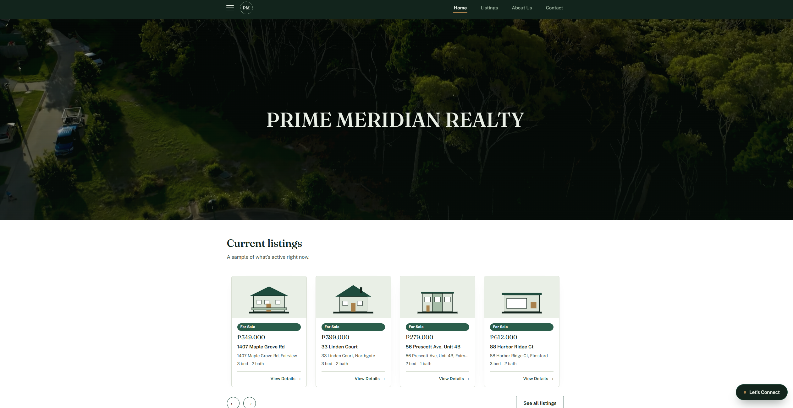
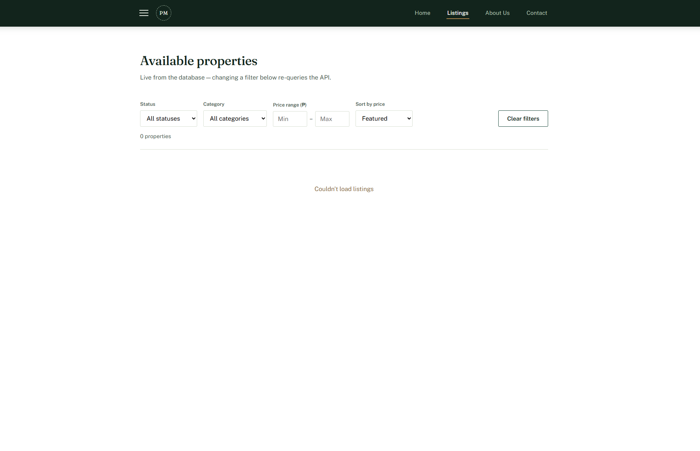
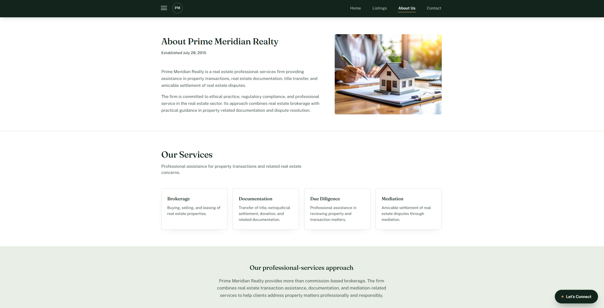
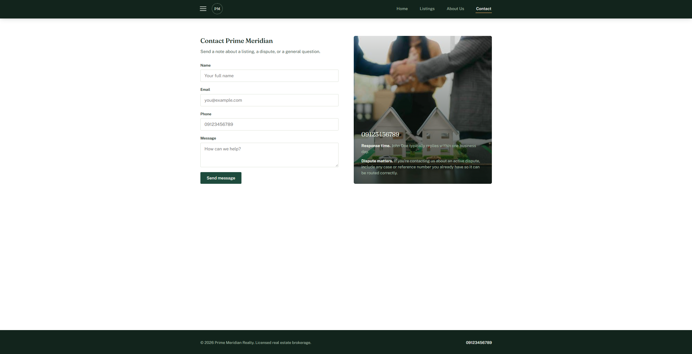

# Prime Meridian Realty

A full-stack real estate website where visitors browse property listings and send inquiries, and an administrator manages listings and reads messages.

**Live site:** https://prime-meridian-olive.vercel.app/
**API:** https://prime-meridian-6zgr.onrender.com/

## What it does

- Browse public listings, filter by status, category and price, and sort by price
- Open a listing to see its details and image gallery
- Send an inquiry about a listing, or a general message, through the contact form
- Sign in as the administrator at `/admin`
- Add, edit and delete listings, and hide listings from the public site
- Read, mark as read and delete inquiries in the admin inbox

## Built with

React 19, React Router and Vite on the front end; Express 5 and PostgreSQL (`pg`) on the back end, written in JavaScript with Node.js and npm. The client is hosted on Vercel, the API on Render, and the database on Neon.

## Running it yourself

**Prerequisites:** Node.js 20 or newer, npm, Git, and a PostgreSQL database (local, or a free one from Neon).

    # 1. get the code
    git clone https://github.com/yuro-nicolas/Prime-Meridian-APSI.git
    cd Prime-Meridian-APSI

    # 2. the database
    # create an empty PostgreSQL database, then run these two files against it
    # (with psql, or by pasting them into the Neon SQL editor):
    #   server/db/schema.sql     tables
    #   server/db/seed.sql       sample listings (optional)

    # 3. the API
    cd server
    npm install
    cp .env.example .env
    node scripts/generate-password-hash.js "choose-a-password"
    # paste the printed ADMIN_PASSWORD_HASH line into .env,
    # and set DATABASE_URL and CORS_ORIGIN=http://localhost:5173
    npm run dev                 # http://localhost:3000/health

    # 4. the client, in another terminal
    cd client
    npm install
    cp .env.example .env        # VITE_API_BASE=http://localhost:3000
    npm run dev                 # http://localhost:5173

Sign in at `http://localhost:5173/admin` with `ADMIN_USERNAME` and the password you hashed.

**Upgrading an older database:** if your tables were created from an earlier version of `schema.sql`, run the files in `server/db/migrations/` in order (001 to 005) instead of re-running the schema. Each one is safe to run more than once.

## Environment variables

None of these are committed. Copy each `.env.example` to `.env` and fill it in locally; on a host, set them in the dashboard.

| Name | Where | What it is |
| --- | --- | --- |
| `DATABASE_URL` | server | PostgreSQL connection string. Contains a password |
| `ADMIN_USERNAME` | server | the admin login name |
| `ADMIN_PASSWORD_HASH` | server | `salt:hash` from `scripts/generate-password-hash.js`. Never the plain password |
| `CORS_ORIGIN` | server | the only site allowed to call the API: `http://localhost:5173` locally, the Vercel URL when deployed. Required; there is no wildcard fallback |
| `NODE_ENV` | server | `development` locally, `production` on Render |
| `PORT` | server | port for the API. Local only; Render sets it itself |
| `VITE_API_BASE` | client | URL of the API, no trailing slash. Built into the JavaScript, so never put a secret here |

`.env` is ignored by `.gitignore`. Production values live only in the Render and Vercel dashboards. **Never commit passwords, database credentials or other secrets to GitHub.**

## API

All request and response bodies are JSON. Admin routes need the header `Authorization: Bearer <token>`, where the token comes from `POST /admin/login`.

| Method | Path | Who | Purpose |
| --- | --- | --- | --- |
| GET | `/health` | public | check the API is running |
| GET | `/properties` | public | list listings. Query: `status`, `category`, `minPrice`, `maxPrice`, `sort=asc\|desc`, `admin=1` (admins also see hidden listings) |
| GET | `/properties/:id` | public | one listing |
| POST | `/properties` | admin | create a listing |
| PUT | `/properties/:id` | admin | update a listing |
| DELETE | `/properties/:id` | admin | delete a listing |
| POST | `/inquiries` | public | send a message: `{ name, email, message, phone?, interestedIn?, propertyId? }` |
| GET | `/inquiries` | admin | list all messages |
| PATCH | `/inquiries/:id` | admin | mark read or unread: `{ isRead }` |
| DELETE | `/inquiries/:id` | admin | delete one message |
| DELETE | `/inquiries?status=read` or `?status=unread` | admin | delete every read, or every unread, message (never both). Returns `{ deleted }` |
| POST | `/admin/login` | public | `{ username, password }` returns `{ token }`. 5 failed attempts blocks that IP for 15 minutes |
| POST | `/admin/logout` | admin | end the session |

Example:

    curl https://YOUR-API.onrender.com/properties?status=For%20Sale&sort=asc

## Deploying

- **Database (Neon):** create a project, then run `schema.sql` and `seed.sql` in the SQL editor. Copy the connection string.
- **API (Render):** new Web Service from this repository. Root directory `server`, build command `npm install`, start command `node server.js`. Set `DATABASE_URL`, `ADMIN_USERNAME`, `ADMIN_PASSWORD_HASH`, `CORS_ORIGIN` (the Vercel URL, no trailing slash) and `NODE_ENV=production` in the Environment tab.
- **Client (Vercel):** import this repository. Root directory `client`, framework preset Vite. Set `VITE_API_BASE` to the Render URL, then redeploy. `client/vercel.json` sends every path to `index.html` so page refreshes work.

There is no GitHub Actions workflow: Vercel and Render deploy straight from the repository. Render's free tier sleeps when idle, so the first request after a while can take up to a minute.

## Project structure

    client/                     React front end, built by Vite
      public/                   images, favicon
      src/
        pages/                  Home, Listings, ListingDetail, AboutUs, Contact, NotFound
        pages/admin/            admin login, listings manager, messages inbox
        components/             layout, home sections, property cards and forms, UI
        hooks/                  data fetching and scroll/route helpers
        lib/api.js              every call to the API goes through here
        styles/                 design tokens and base styles
      .env.example              placeholder values only
      vercel.json
    server/                     Express API
      server.js                 app setup, CORS, routes, error handler
      routes/                   properties, inquiries, admin login
      db/                       pool, queries, schema.sql, seed.sql, migrations/
      middleware/adminAuth.js   password check, sessions, rate limiting
      scripts/                  generate-password-hash.js
      .env.example              placeholder values only
    docs/                       proposal, mockup, design system, screenshots
    AI-USAGE.md

## Architecture

The React client calls the Express API over HTTP using `fetch`. Express checks the origin (CORS), validates the request, checks the admin token where needed, and reads and writes PostgreSQL with parameterised SQL over SSL.

    React + Vite (Vercel)  --HTTP/JSON-->  Express (Render)  --SQL-->  PostgreSQL (Neon)

## Security

Each row is answered Yes, No or N/A, with what I checked. The one No (row 14) is a limit of Neon's free plan and is explained in its row.

### Secrets and credentials

| # | Check | Yes / No / N/A | Evidence |
| --- | --- | --- | --- |
| 1 | .env is gitignored and is not in the repository | Yes | `.gitignore` lines 2–4 ignore `.env` and `.env.*` but keep `.env.example`; `git ls-files \| grep -iE '\.env$\|\.pem$\|id_rsa'` prints nothing. |
| 2 | A .env.example with placeholder values only is committed | Yes | `server/.env.example` and `client/.env.example` are committed; `DATABASE_URL` is `user:password@host`, and `ADMIN_PASSWORD_HASH` is empty. |
| 3 | No connection string, key, token or password is hardcoded in source, comments or commented-out code | Yes | Searched `client/src` and `server/`. The API URL comes from `VITE_API_BASE`, and the database URL, admin username and password hash come from `process.env`. The only connection strings are the placeholders in `.env.example`. |
| 4 | Git history is clean: I searched git log -p for password, secret, api key and postgres:// | Yes | Ran `git log -p --all` and searched for those words plus `neon.tech`, `onrender.com` and `passcode`. Every match is a variable name, a comment or a placeholder such as `user:pass@host`; no real value was ever committed. |
| 5 | Any credential that was ever committed has been rotated | N/A | Nothing to rotate: row 4 found no credential in the history. |
| 6 | Production credentials live only in my hosting provider's environment settings | Yes | `DATABASE_URL`, `ADMIN_USERNAME`, `ADMIN_PASSWORD_HASH` and `CORS_ORIGIN` are set in Render's Environment tab, and `VITE_API_BASE` in Vercel's Environment Variables. None are in the repository. |

### GitHub Actions

| # | Check | Yes / No / N/A | Evidence |
| --- | --- | --- | --- |
| 7 | No secret value is written literally in any workflow YAML file | N/A | The project has no GitHub Actions workflows. I deleted the template's `.github/workflows/deploy-pages.yml` because Vercel and Render deploy straight from the repository. |
| 8 | Secrets are stored in repository Actions secrets and read with `${{ secrets.NAME }}` | N/A | No workflows (see row 7). |
| 9 | No workflow step echoes, dumps or debug-prints a secret, and I opened a recent run's log to confirm | N/A | No workflows (see row 7). |
| 10 | Uploaded build artifacts contain no `.env`, key file or generated config | N/A | No workflows (see row 7). |
| 11 | Third-party actions are pinned to a commit SHA, not a moveable tag | N/A | No workflows (see row 7). |
| 12 | Secret scanning and push protection are enabled on the repository | Yes | Turned both on in Settings > Code security. They are free for public repositories. |

### Database

| # | Check | Yes / No / N/A | Evidence |
| --- | --- | --- | --- |
| 13 | Every query taking user input uses parameters, never string concatenation | Yes | Every `pool.query` in `server/db/properties.js` and `server/db/inquiries.js` passes values in an array with `$1, $2…`. The listings filter builds its `WHERE` clause only from fixed strings and adds a placeholder for each value; `sort` is only compared, never inserted. |
| 14 | The database is not open to the whole internet, or is reachable only by the app | No | Neon's free plan cannot restrict connections by IP, so the host is reachable from the internet. Connecting still needs the password, which only Render has, and `db/pool.js` requires SSL. |
| 15 | The database user the app connects as has only the permissions it needs | Yes | The API connects to Neon as `app_user`, which only has CONNECT, USAGE on the `public` schema, SELECT/INSERT/UPDATE/DELETE on `properties` and `inquiries`, and use of their `id` sequences. It cannot create, change or drop tables; I run `schema.sql` and migrations separately as the owner role. |
| 16 | Seed and sample data is invented, not real people's data | Yes | The six sample listings in `server/db/seed.sql` have made-up addresses and towns. The one real listing has only a subdivision-level address and property details, with no owner name, phone number or email. |
| 17 | Debug, seed and reset routes are removed before going public | Yes | The API has no seed, reset or debug routes (checked every route in `server/routes/`). `/health` returns only `{ status: "ok" }`. `DELETE /inquiries` clears the admin inbox and requires an admin token. |

### Access control

| # | Check | Yes / No / N/A | Evidence |
| --- | --- | --- | --- |
| 18 | The app has an access layer: Cloudflare Zero Trust, an app-level password, or a real login | Yes | A real server-side admin login: `POST /admin/login` checks the password against a scrypt hash, returns a session token that expires after 12 hours, and blocks an IP for 15 minutes after 5 failed attempts. The public listing pages are meant to be open. |
| 19 | If Supabase or Firebase: Row Level Security or security rules are on, and I tested it signed out | N/A | The app uses Express and PostgreSQL on Neon, not Supabase or Firebase. |
| 20 | If Zero Trust: the instructor's email is on the access policy. If an app password: the credentials are in my private workspace project/README.md | Yes | This is an app login, not Zero Trust. |
| 21 | The gate covers every route, including the ones that only change data | Yes | Every route that changes or reads private data uses `requireAdmin`: POST, PUT and DELETE on `/properties`, and GET, PATCH and DELETE on `/inquiries`. Hidden listings are only returned when a valid token is sent. The only public write is `POST /inquiries`, the contact form, which is public on purpose. |
| 22 | The credentials for the gate are environment variables, not in source | Yes | `server/middleware/adminAuth.js` reads `process.env.ADMIN_USERNAME` and `process.env.ADMIN_PASSWORD_HASH`. The plain password is never stored anywhere, and the old passcode that was checked in the browser was removed. |

### Input and output

| # | Check | Yes / No / N/A | Evidence |
| --- | --- | --- | --- |
| 23 | Input from the user is validated on the server, not only in the browser | Yes | `routes/inquiries.js` rejects a message without name, email or message, and rejects a `propertyId` that is not a real listing. `routes/properties.js` checks `status` and `category` against allowed lists, and the price filters must be numbers. Text fields do not have length limits yet. |
| 24 | User-supplied text is escaped when rendered, so it cannot inject markup or script | Yes | Everything is rendered through React JSX, which escapes text; searched `client/src` and there is no `dangerouslySetInnerHTML` or `innerHTML`. |
| 25 | Error responses do not expose stack traces, file paths or connection details | Yes | The error handler in `server.js` logs the error on the server and returns only `{ error: "Something went wrong on the server" }`, and unknown routes return `{ error: "Not found" }`. `NODE_ENV=production` is set on Render. |
| 26 | CORS is not a wildcard on routes that change data | Yes | `server.js` uses `cors({ origin: process.env.CORS_ORIGIN })`, and `CORS_ORIGIN` on Render is set to only my Vercel URL. |

### Repository and privacy

| # | Check | Yes / No / N/A | Evidence |
| --- | --- | --- | --- |
| 27 | No student number, personal email, phone number or home address in the repository or in commit messages | Yes | The files and commit messages are clean (searched with `git grep` and `git log -p`), and the README credits only my GitHub profile. I found my personal email as the author email on 13 commits, rewrote them to my GitHub noreply address with `git filter-repo`, and force-pushed. A fresh clone's `git log --format=%ae` now shows only `…@users.noreply.github.com` on all 45 commits. |
| 28 | No classmate's personal data in the repository | Yes | Searched the files and history: no classmates' names, emails, numbers or photos. The sample data is invented (row 16), and inquiries are stored only in the database, never in the repository. |
| 29 | Dependencies come from official registries, and node_modules is gitignored | Yes | All 156 `resolved` URLs in both `package-lock.json` files point to `registry.npmjs.org`; `node_modules/` is `.gitignore` line 7. `npm audit` reports 0 vulnerabilities in both `client` and `server`. |
| 30 | Images, fonts and other assets are mine, licensed, or credited | Yes | The house illustration and icons are SVGs I made with AI help, recorded in `AI-USAGE.md`. The fonts Fraunces and Public Sans come from Google Fonts under the Open Font License. The background photos will be placed in `client/public/images/`. |
| 31 | Repository visibility is deliberate, and I checked it after my last push | Yes | The repository is public on purpose, because the course requires a public repository. I checked Settings > General after my last push; it shows Public. |

### Anything I found and fixed

The checklist caught that 13 of my commits showed my personal Gmail address as the author email, which anyone could see on GitHub. I rewrote those commits to my GitHub noreply address with `git filter-repo`, force-pushed, and turned on GitHub's email privacy settings so it cannot happen again. It also caught that the class template's GitHub Pages workflow was still running on every push even though I deploy with Vercel, so I deleted it, and that the API allowed every website when `CORS_ORIGIN` was not set, so I removed the `*` fallback and set `CORS_ORIGIN` on Render to my Vercel URL.

## Screenshots

**Home**

**Listings**

**About Us**

**Contact**

## What I would do next

- Store admin sessions in the database so logins survive a server restart
- Add `helmet`, length limits on text fields, and rate limiting on the contact form
- Let the admin upload listing photos instead of pasting image URLs

## Author

[github.com/yuro-nicolas](https://github.com/yuro-nicolas)

## AI use

I used Claude and other AI assistants heavily. I built the first version myself as static HTML pages and decided what the site should do, then used AI to turn it into React, build the Express API and PostgreSQL database, add the admin login, and help with security and documentation. I tested and corrected everything it gave me. The full account, including where the AI got it wrong and which parts are mine, is in [AI-USAGE.md](AI-USAGE.md).

## Licence

MIT, see [LICENSE](LICENSE).
